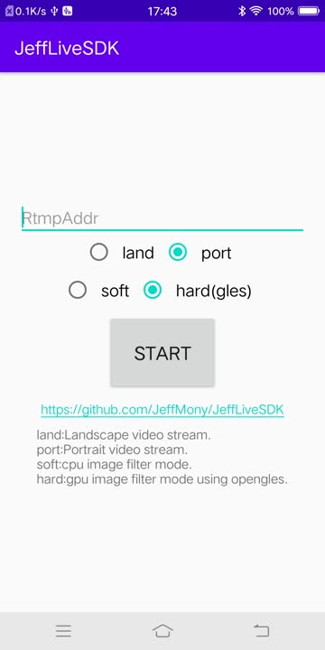
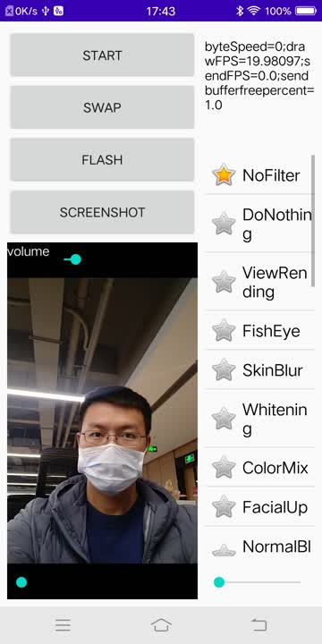
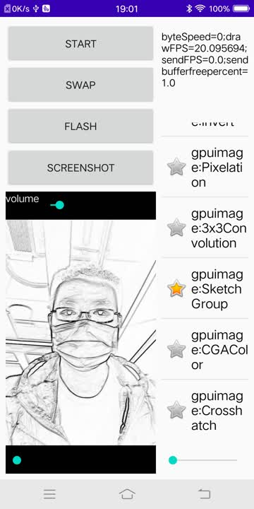
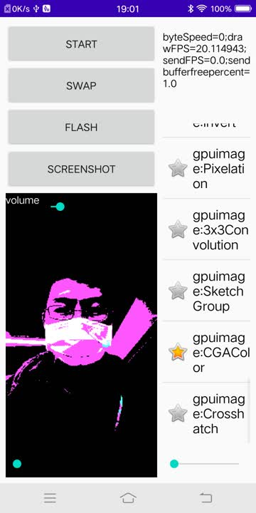

# JeffLiveSDK
Android 平台下的直播SDK
> * 实现opengl 滤镜
> * 实现H264视频编码,AAC音频编码
> * 实现FLV封包
> * 实现RTMP推流

主要的滤镜如下：
> * ViewRending
> * FishEye
> * SkinBlur
> * Whitening
> * ColorMix
> * FacialUp
> * NormalBlend
> * GroupFilter
> * DifferenceBlend
> * SobelEdgeDetection
> * Icon
> * SeaScape
> * SimpleText
> * HtmlText
> * MoreText
> * TimeStamp
> * invertText
> * GaussianBlur
> * gpuimage:Invert
> * gpuimage:Pixelation
> * gpuimage:3x3Convolution
> * gpuimage:SketchGroup
> * gpuimage:CGAColor
> * gpuimage:Crosshatch

感谢的开源项目是：
> * librestreaming
> * android-gpuimage

感谢关注公众号JeffMony，持续给你带来音视频方面的知识。

